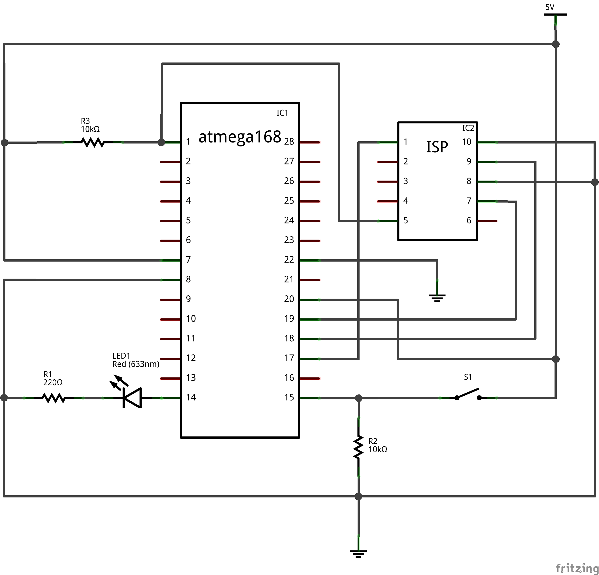
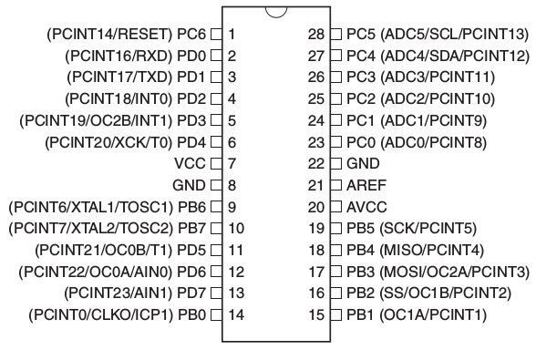

# Embedded AVR atmega 8bit GPIO kata

## Assignment

The push button _S1_ shall behave as a toggle switch to turn the led _LED1_ on and off.

```cucumber
Scenario: Initial state

    Given the device is powered on
    Then the LED is turned off
```

```cucumber
Scenario: Turn LED on

    Given the device is powered on
    When I press the button
    Then the LED is turned on
```

```cucumber
Scenario: Turn LED off

    Given the device is powered on
    When I press the button
    And I press the button again
    Then the LED is turned off
```

## Target Hardware

Schematic:


Atmega168 pin configuration:


## Build and Run

The qmake project provides the following make targets.

Run the unit tests:
```
make check
```

Run the feature tests:
```
make run-bdd
```

Download the _firmware_ to the AVR
```
make flash
```

## AVR GPIO cheatsheet

```cpp
#ifdef __AVR
// avr-gcc defines preprocessor variable __AVR
#endif

// pin and port definitions
#include <avr/io.h>

// set pin PB0 as output, PB7-PB1 as input
DDRB = _BV(PB0);

// set pin PB0 as input, PB7-PB1 as output
DDRB = ~(_BV(PB0));

// clear PB0
PORTB &= ~(_BV(PB0));

// set PB0
PORTB |= _BV(PB0);

// toggle PB0
PORTB ^= _BV(PB0);

// read port
unsigned port = PINB

// check pin PB0
bool state = PINB & _BV(PB0)
```

